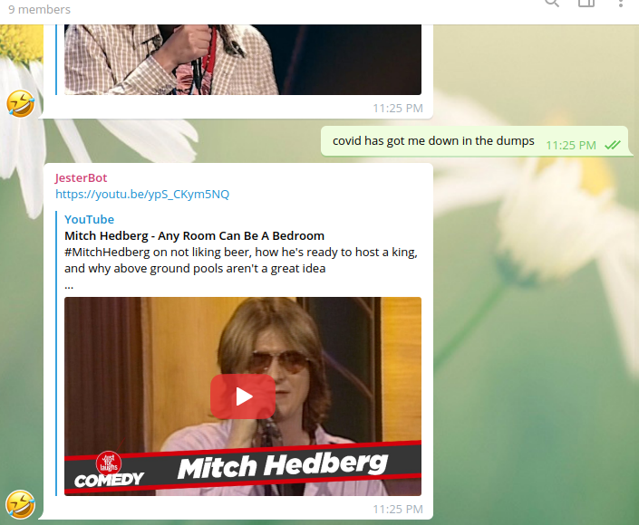
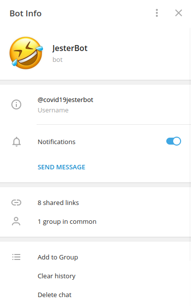

# JesterBot 

### Summary
JesterBot was developed on Google Dialogflow and serves as an exercise for serving media to group chats on Telegram.   

This chat bot was created to be an icebreaker and mood lightener in the oftentimes melancholic environment brought upon by the Covid-19 Pandemic.   

Every time JesterBot detects recurring negativity in a group chat it sends a video (1 of 30) of a world-renowned comedian's stand up routine to ease tensions and spread good vibes.  

### Screenshot   
Here is a screenshot of the JesterBot in action:  
    

### Try it!
If you want to try out JesterBot for yourself on Telegram and share it with friends, just search for '@covid19jesterbot' in Telegram. Today is the first day of the rest of your life, and laughter is the best medicine!   

___
#### Citations:
All video content used by JesterBot is the property of *Just For Laughs*, the *Just For Laughs Fesival*, and other respective owners. I do not own any of the IP used in this project aside from the development of the chat bot, and all sourced materials are used under Fair Use.
